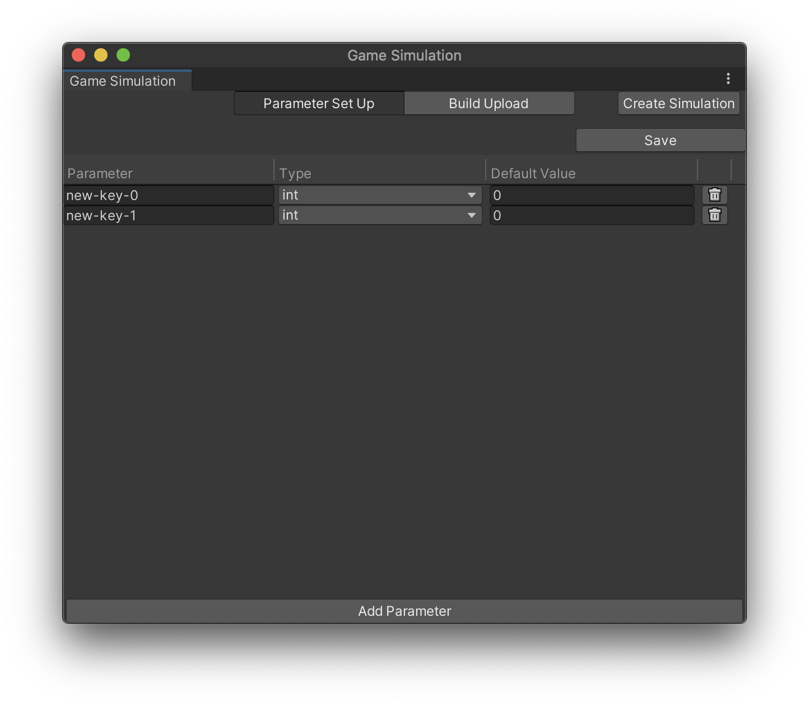
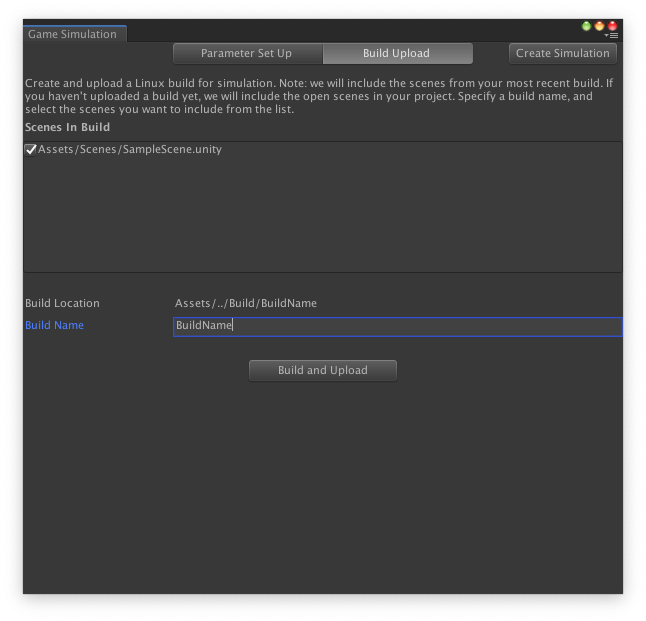

# Game Simulation window
To use Unity Game Simulation, you must link your project to a Unity Cloud Project ID. In an unlinked project, the Game Simulation window (**Window** > **Game Simulation**) displays a message indicating how to link your project. You can link a Unity project to a Unity Cloud Project ID in the Services window (**Window** > **General** > **Services**).

When you have linked a project, you see two tabs at the top of the Game Simulation window (**Parameter Set Up** and **Build Upload**) and a **Create Simulation** button. Click **Create Simulation** to go to the associated page for your project on https://gamesimulation.unity3d.com. 

The tabs are described below.

## Parameter Set Up tab
The **Parameter Set Up** tab lists simulation parameters and lets you configure them.

 

To upload any pending changes, click **Save** at the top of the window. 

Below this, each parameter is listed in a table:

- The **Parameter** column contains an editable text field to name a parameter. 
- The **Type** column identifies the type of the parameter; one of: string, bool, float, int, long.
- The **Default Value** column specifies the value this parameter holds initially.

To delete the parameter, click the trash can button.

To add a row to the table, click **Add Parameter** at the bottom of the window.

## Build Upload tab
The **Build Upload** tab lets you create and upload a build for running a simulation.

 

Select the scenes to include in the build, specify a name in the **Build Name** text field, then click **Build and Upload** to create a build and upload it for simulation. After upload, your build appears as a simulation target on https://gamesimulation.unity3d.com.

Any build errors appear below the **Build and Upload** button and in the Unity Editor's console. Game Simulation requires the 64-bit Linux build target.
