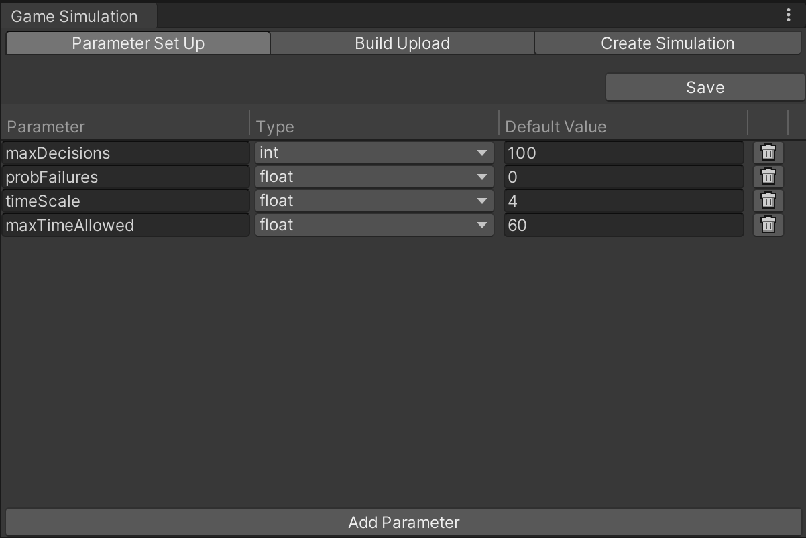
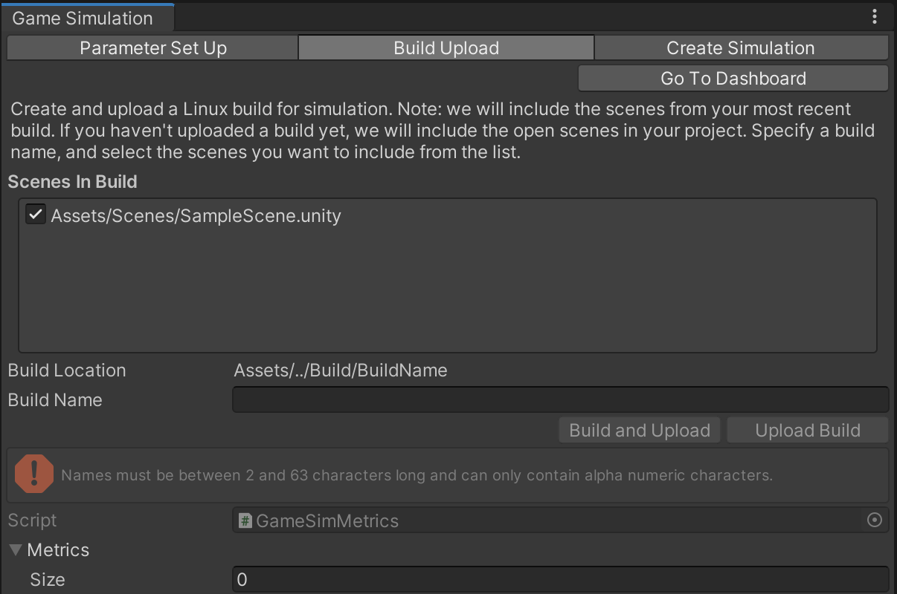

# Game Simulation window
To use Unity Game Simulation, you must link your project to a Unity Cloud Project ID. In an unlinked project, the Game Simulation window (**Window** > **Game Simulation**) displays a message that indicates how to link your project. You can link a Unity project to a Unity Cloud Project ID in the Services window (**Window** > **General** > **Services**).

When you have linked a project, two tabs appear at the top of the Game Simulation window: **Parameter Set Up** and **Build Upload**. A **Create Simulation** button also appears. Click **Create Simulation** to go to the associated page for your project on https://gamesimulation.unity3d.com. 

The tabs are described below.

## Parameter Set Up tab
The **Parameter Set Up** tab lists simulation parameters and lets you configure them.

 

To upload any pending changes, click **Save** at the top of the window. 

Below this, each parameter is listed in a table:

- The **Parameter** column contains an editable text field to name a parameter. 
- The **Type** column identifies the type of the parameter; one of: string, bool, float, int, long.
- The **Default Value** column specifies the value this parameter holds initially.

To delete the parameter, click the trash can button.

To add a row to the table, click **Add Parameter** at the bottom of the window.

## Build Upload & Add Metrics tab
The **Build Upload** tab lets you create and upload a build for running a simulation.

 

To create a build and upload it for simulation, select the scenes to include in the build, specify a name in the **Build Name** text field, then click **Build and Upload**. After upload, your build appears as a simulation target on https://gamesimulation.unity3d.com.

Any build errors appear below the **Build and Upload** button and in the Unity Editor's console. Game Simulation requires the 64-bit Linux build target.

Optionally, to **Add Metrics** to your build: add the number of metrics you'd like to include to the 'Size' column at the bottom of the window, then in the proceeding rows add the names of the metrics you'd like to track. After simulations with this build & metrics complete, the metrics specified here will appear in your raw and aggregate reports. 

## Create Simulation tab
The **Create Simulation** tab lets you run a simulation.

 

To create and run a simulation, specify values for each text input field.  Notes: At least one value is required for each parameter **Values** text field.  To add multiple parameter values, use comma separated values in the input field.  

By default, simulations run from the editor window will use the **grid search** algorithm to test all possible parameter value combinations.  To specify the maximum number of simulation **Runs per parameter value combination** update the corresponding text field.  
 - In the example above, maxDecisions has 1 parameter value (1), probFailures has 1 (2), timeScale has 2 (3,4) and maxTimeAllowed has 2 (4,5), which means in total there will be 1 * 1 * 2 * 2 = 4 possible parameter value combinations run for my simulation.  
 - If I specify the **Runs per Parameter Combination** is 5, I can expect each parameter value combination will run 5 simulations each i.e. 4 combinations * 5 = 20 total simulation runs 

Any input errors appear below the **Run** button and in the Unity Editor's console. When you're ready to run your simulation click the **Run** button.  If the simulation is created successfully, a **Visit Simulation Dashboard** button and **Create Another Simulation** button will appear.  Your simulation status and results will be available on the web dashboard, where you can also create and run simulations: https://gamesimulation.unity3d.com.
